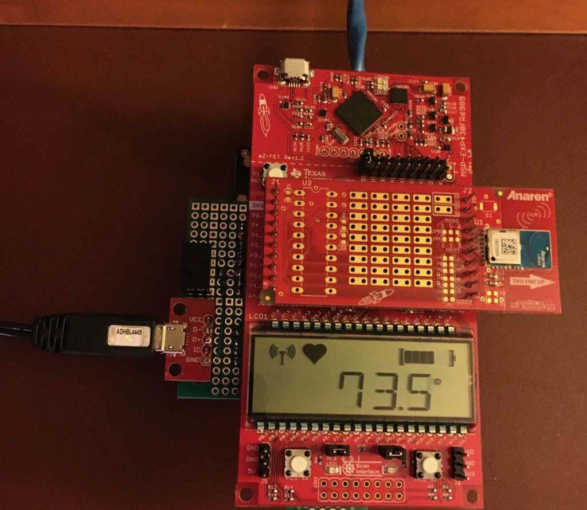
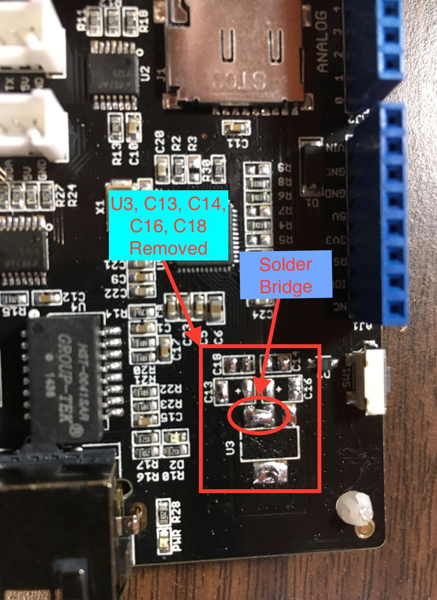
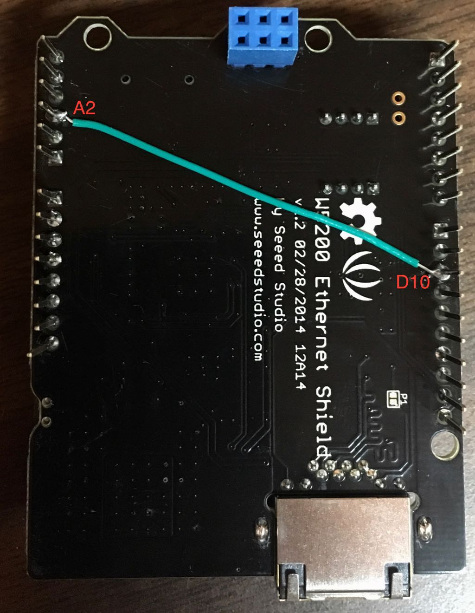
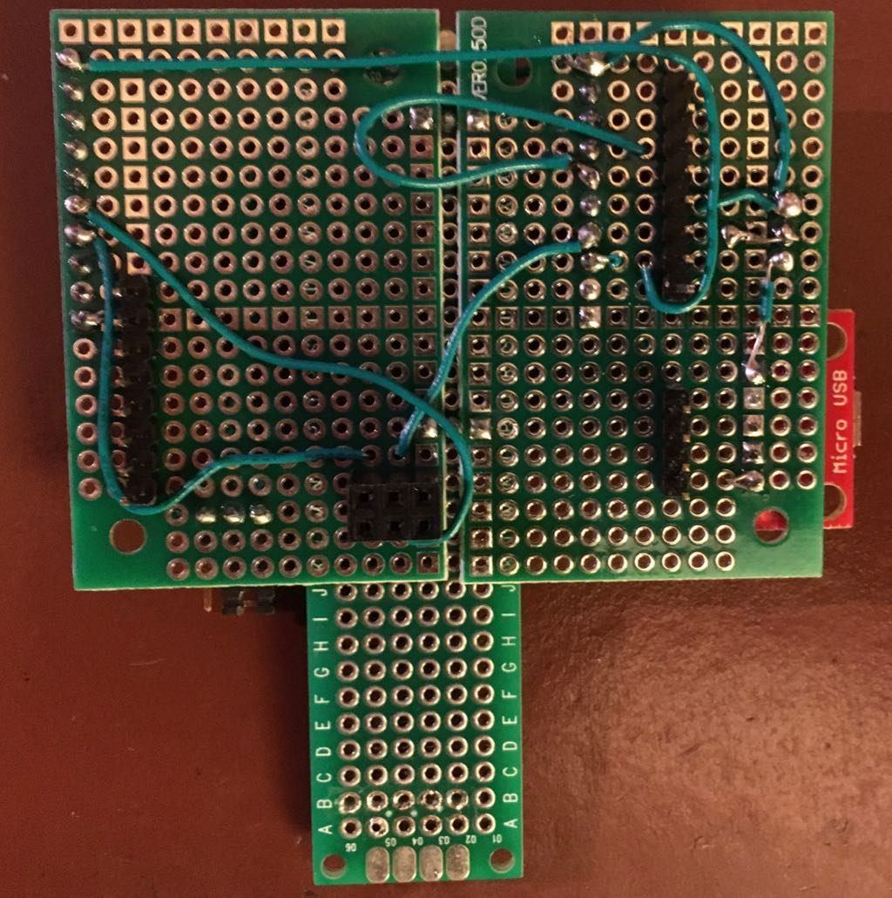
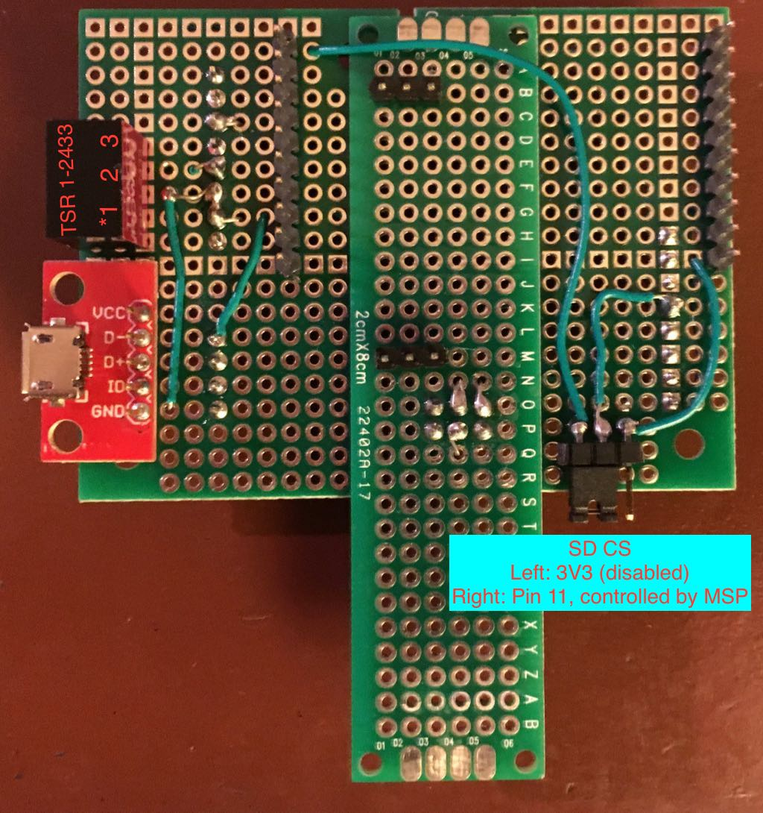

# Wireless Sensor Receiver Hub

## Hardware

- MSP-EXPFR6989 LaunchPad
- CC110L BoosterPack
- SeeedStudio W5200 Ethernet Shield
- Custom Shield-LaunchPad Interface Board

### MSP-EXPFR6989 LaunchPad

- 128 KB Non-volatile FRAM
- 2 KB Static RAM
- Built-in 6-digit alpha-numeric LCD with 6 special symbols
- [Technical Info](http://www.ti.com/tool/MSP-EXP430FR6989)

### CC110L BoosterPack

- Low-power wireless transceiver operating on 902-928MHz ISM band
- [Quick Start Guide](https://www.ti.com/lit/ml/swru312b/swru312b.pdf)

### SeeedStudio W5200 Ethernet Shield

- WIZnet W5200 Embedded Ethernet Controller
- MicroSD Card Slot
- [Product Page](http://wiki.seeedstudio.com/Ethernet_Shield_V2.0/), including links to technical info
- This board is designed to interface with Arduino controllers with 5V power and requires hardware modifications and an interface board (see "Custom Shield-LaunchPad Interface Board" below) to route signals to an MSP430 LaunchPad.

#### Ethernet Shield Hardware Modifications

All devices on the board run at 3.3V, but the board has an LM1117-3.3 type regulator so it can be powered directly from the 5V pin from an Arduino UNO.

- Remove U3 Voltage Regulator along with de-coupling capacitors C13, C14, C16, C18.
- Solder-jumer together the solder pads for pins 2 and 3 of the U3 outline.

This will directly connect the 5V pin to the 3.3V power rail on the board.

Because of the mis-aligned header on the [Arduino UNO layout](https://forum.arduino.cc/t/making-pwm-pins-together/22809/14), pin D10 on the shield is not easily accessible from a standard 0.1" perfboard. So make the signal accessible on an unused pin on one of the standard-spaced headers.

- Solder a jumper wire (the bottom of the board works best) from pin D10 to pin A2.

### Custom Shield-LaunchPad Interface Board

The interface board ([schematic][1]) is necessary to provide power to the Sensor Receiver Hub and to route signals between the Ethernet Shield and the LaunchPad, since they use incompatible I/O pin layouts.
Besides a properly-sized perfboard, you will need:

- Male headers: 8-pin, 6-pin, and 10-pin for the shield connection and two 10-pin for the LaunchPad connection
- USB Micro [break-out board](https://www.sparkfun.com/products/12035)
  - This is for simplicity of using a standard USB wall-wart power supply. A 2-pin header could also be used, depending on your needs.
- Traco [TSR 1-2433 DC-DC converter](https://www.mouser.com/datasheet/2/687/tsr1-537631.pdf)
  - A cheaper 3.3V linear regulator that can provide at least 250 mA could also be used, but is not as efficient as the Traco module.

- Bottom

- Top
- 

[1]: ./Shield-LaunchPad-Interface.pdf
[200]: https://github.com/Andy4495/Wireless-Sensor-Receiver-Hub

[//]: # (Dead link to old forum post about misaligned Arduino headers: http://forum.arduino.cc/index.php/topic,22737.0.html#13)
