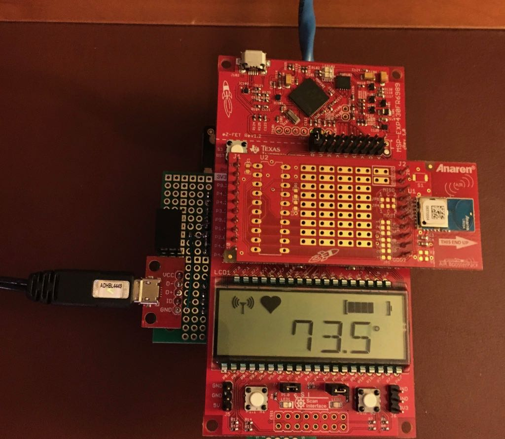

Wireless Sensor Receiver Hub
============================

This sketch is designed to run on an MSP-EXPFR6989 LaunchPad, CC110L BoosterPack, and W5200-based ethernet shield. It should run on other MSP430-based lauchpads with sufficient program memory.
The code is not very generic and is currently written to support two types of sensors with specific data structures:
- An outdoor weather sensing station based on the SENSORS BoosterPack
- Simple, low-power MSP430 module using its internal temperature sensor

The current design sends the received sensor readings to the [ThingSpeak][5] IOT platform. Previous iterations used [Adafruit's][4] and [Cayenne's][9] platforms.

The built-in LCD display on the LaunchPad is used to display current temperature and battery level from the weather station sensor, plus connection status with the MQTT server.

An additional external OLED display is also supported, and can be used to print miscellaneous status information. This OLED display is optional and not necessary for basic receiver hub operation.

Additional sensors and changes to the data structures of the existing sensors would require changes to this sketch. Feel free to use this as a starting point, but do not expect it to work as-is for your application.

See the [Hardware](./Hardware) folder for specific hardware details.

Please read the .ino file comments for details on the software operation.

## External Header Files ##

In order to compile the code, two header files are needed:
* MQTT_private_config.h
* MQTT_private_feeds.h

The details on the contents of these files are in the .ino file comments.

## External Libraries ##
* [Adafruit_MQTT](https://github.com/adafruit/Adafruit_MQTT_Library)  
  *See the [Adafruit_MQTT][8] readme file for changes necessary to support long `connect` messages, which are generated when using the [Cayenne][9] platform.*
* [WIZnet Ethernet](https://github.com/Wiznet/WIZ_Ethernet_Library)  
  *[Modifications](./Ethernet.md) are required to work with Energia and fix a memory leak.*
* [NewhavenOLED](https://github.com/Andy4495/NewhavenOLED)  
  _The NewhavenOLED library is only needed if you plan to use an external OLED
  display as mentioned above._

## References ##
* [MSP430FR6989 LaunchPad][1]
* [CC110L BoosterPack][2]
* [Seeed Studio W5200 Ethernet Shield][3]
* [Adafruit IO][4]
* [ThingSpeak][5] IoT Platform
* [Cayenne][9] IoT Platform

[1]: http://www.ti.com/tool/MSP-EXP430FR6989
[2]: http://www.ti.com/tool/430BOOST-CC110L
[3]: http://wiki.seeedstudio.com/Ethernet_Shield_V2.0/
[4]: https://io.adafruit.com/
[5]: https://thingspeak.com/
[8]: ./Adafruit_MQTT.md
[9]: https://cayenne.mydevices.com
